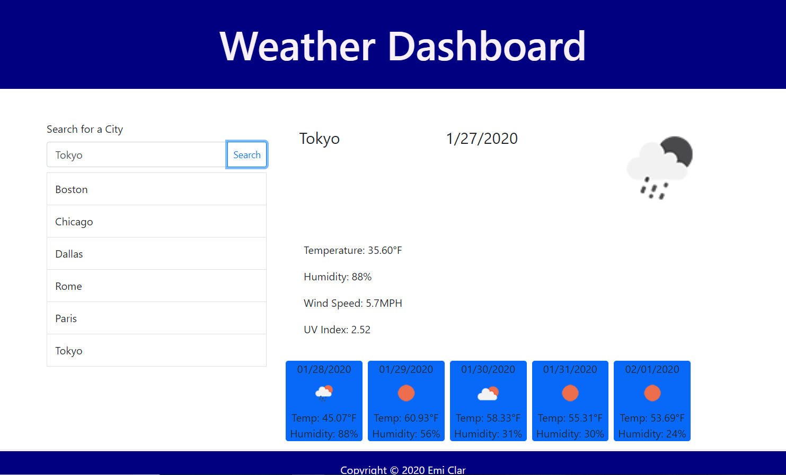

# Weather-Dashboard
A weather dashboard using the OpenWeather API.

### Table of Contents
* General Info
* Files
* Technologies

### General Info
This is a weather dashboard application with search functionality to find current weather conditions and the future weather outlook for multiple cities.

### Link
[Click here to use the Weather Dashboard](https://emi-dev.github.io/Weather-Dashboard/)

### Files
* index.html
* style.css (under "assets/css")
* weather.js (under "assets/js")
* README.md

### Technologies
Project is created with:
* JavaScript
* HTML 5
* CSS 3
* Bootstrap 4

